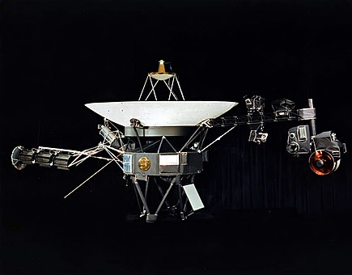

# Voyager 1

Voyager 1 est l'une des deux sondes spatiales jumelles du programme spatial Voyager de la NASA destinées à l'étude des planètes externes du Système solaire qui n'avaient jusque-là été observées qu'au moyen de téléscopes situés sur terre, notamment les systèmes de Jupiter et de Saturne. Son lancement a eu lieu le 5 septembre 1977

Icone recuperée dans [google wikipédia](https://fr.wikipedia.org/wiki/Voyager_1)

## Caractéristiques techniques

- Masse au lancement : 721.9 kg
- Masse instruments : 105 kg
- Masse ergols : 90 kg
- Puissance électrique : 470 watts (au lancement)

## Principaux jalons 

- Lancement : 5 septembre 1977
- Survol de Jupiter : 5 mars 1979
- Survol de Saturne : 10 novembre 1980
- Distance par rapport au Soleil : 24 077 845 440 kmq 

