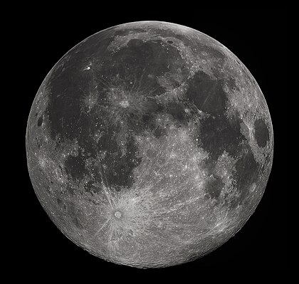

# Lune

La lune est l'unique satellitte naturel permanent de la planète Terre. Il s'agit du cinquième plus grand satellite naturel du système solaire, et du plus grand des satellites planétaires par rapport à la taille de la planète autour de laquelle il orbite.

## Caractéristiques

- Masse : 7.347 7 x 1022 kg
- Demi-grand axe : 384 399 km
- Apogée : 406 300 km
- Périgée : 356 700 km
- Rayon équatorial : 1 737.4 km
- Rayon polaire : 1 735.97 km
- Superficie : 37 871 220.85 km2
- Volume : 2.195 8 x 1010 km3
- Masse volumique globale : 3.3464 x 103 kg/m3.