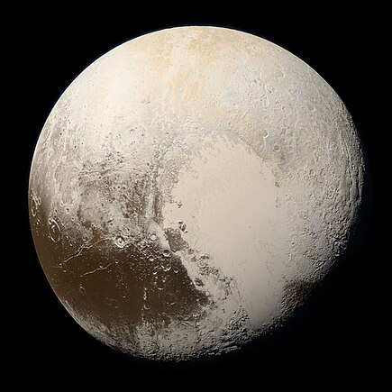

# Pluton (planète naine)

Pluton est une planète naine, la plus volumineuse connue dans le Système solaire, et la deuxième en ce qui concerne sa masse (après Eris). Pluton est ainsi le neuvième plus gros objet connu orbitant directement autour du Soleil et le dixième par la masse.

## Caractéristiques

- Masse : 1.3 x 1022
- Diamètre : 2372 km

