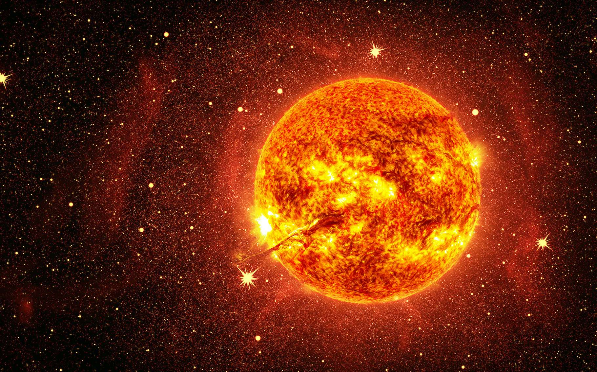

# Soleil

Soleil est l'étoile du système solaire. Dans la classification astronomique, c'est une étoile de type naine jaune.

## Caractéristiques

- Masse : 1.9891 x 1030 kg
- Diamètre moyen : 1 392 684 km
- Distance du centre de la Voie lactée : 2.52 x 1017 km
- Vitesse : 217 km/s
- Rayon équatorial : 696 342 km
- Surface : 6.0877 x 1012 km2
- Volume : 1.412 x 1018 km3
- Masse volumique :
  - moyenne : 1 408 kg/m3
  - au centre : 150 000 kg/m3
